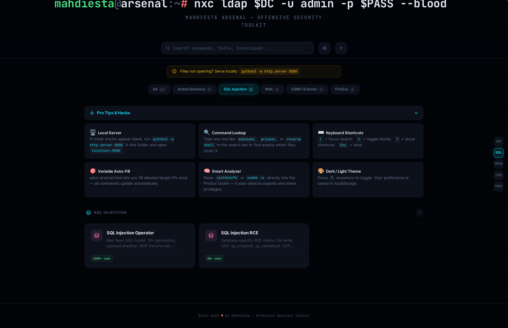

# TheCompleteMahdiestaArsenal

Browser-based offensive security reference. Fill your `KALI_IP`, `TARGET`, and creds once — every command across all 15 tools updates live. No scripting. No copy-paste hell.

[](LICENSE)
[]()
[]()
[]()

---


---

## Tools

| Tool | Coverage |
|---|---|
| **AD Boom** `v5.0` | 325+ commands — NTLM relay, Kerberoasting, AS-REP roasting, RBCD, DCSync, Pass-the-Hash/Ticket, secretsdump |
| **ADCS Arsenal** | ESC1–ESC16 full attack chains — certipy, PKINIT, shadow credentials, template abuse |
| **NetExec Guide** | SMB / LDAP / RDP / WinRM — spray, enum, shares, LSA, NTDS, sam |
| **BloodHound Arsenal** | Attack path methodology + full Cypher query library — shortest paths, owned objects, OSCP+ oriented |
| **bloodyAD Arsenal** | DACL/ACL abuse — GenericAll, WriteDACL, GenericWrite, shadow creds, targeted Kerberoast, object takeover |
| **Rubik's Cube Injector** `v5` | UNION / Blind / Time-based / OOB / Error-based · WAF bypass encodings · sqlmap builder · 1000+ payloads |
| **SQLi RCE** | SQLi → shell chains — `INTO OUTFILE`, `xp_cmdshell`, `LOAD DATA INFILE`, stacked queries |
| **Web Arsenal** | Rev shells, LFI/RFI chains, SSRF, file upload filter bypass, SSTI, path traversal |
| **WebEnum Arsenal** | Full enum workflow — vhosts, dirs, tech fingerprinting, API endpoint discovery |
| **AuthBreaker** | JWT manipulation, OAuth abuse, IDOR, broken auth, session fixation, password reset flaws |
| **Command Injection Solver** | Blind/OOB CI, filter bypass (space, pipe, semicolon, wildcard), payload library |
| **OSINT Dorks** `v3.0` | Google / Shodan / GitHub / Censys / Fofa — recon, exposed secrets, infra mapping |
| **PrivEsc Toolkit** | Windows: token privs, service hijacking, DLL hijack, unquoted paths, scheduled tasks, AlwaysInstallElevated, SAM — Linux: SUID, sudo rules, cron, capabilities, writable paths |
| **TokenPriv Operator** | Full Windows token privilege arsenal — SeImpersonate, SeDebug, SeRestore, SeTakeOwnership — GodPotato, PrintSpoofer, RoguePotato chains |

---

## Screenshots

<table>
<tr>
<td></td>
<td></td>
</tr>
<tr>
<td></td>
<td></td>
</tr>
<tr>
<td></td>
<td></td>
</tr>
</table>

---

## Variable System

Every sheet has a variable bar at the top. Set your values once:

```
KALI_IP   TARGET   USER   PASS   DOMAIN   WPATH   PORT   RPORT
```

Every command — certipy, netexec, sqlmap, msfvenom, wget — renders with your values substituted. No templates. No regex. Just fill and copy.

Works across all tools simultaneously. Switch OS mode in PrivEsc and the varbar adapts — Windows-only fields (WPATH, SVCBIN, DOMAIN) hide, Linux fields (LFILE) appear.

---

## Quick Start

```bash
git clone https://github.com/xl337x/TheCompleteMahdiestaArsenal
cd TheCompleteMahdiestaArsenal
python3 -m http.server 8000
# open http://localhost:8000
```

Or just open `index.html` directly in the browser. No server required for most tools.

---

## Shortcuts

| Key | Action |
|---|---|
| `/` | Focus search |
| `T` | Toggle dark / light theme |
| `Esc` | Clear search / close modal |
| `?` | Show all shortcuts |

---

## Structure

```
├── index.html                          # Main portal — search, filter by category
├── ad-boom.html                        # AD PenTest Intelligence Engine v5.0
├── adcs-arsenal.html                   # ADCS ESC1–ESC16 reference
├── netexec-guide.html                  # NetExec multi-protocol guide
├── bloodhound-arsenal.html             # BloodHound attack paths + Cypher library
├── bloodyad-arsenal.html               # bloodyAD DACL/ACL abuse reference
├── sqli-operator.html                  # Rubik's Cube Injector v5
├── sqli-rce.html                       # SQLi → RCE chains
├── web-arsenal.html                    # Web exploitation + reverse shell engine
├── web-enumeration.html                # Web enumeration workflow
├── auth-bypass.html                    # Authentication bypass toolkit
├── command-injection.html              # Command injection solver
├── osint-dorks.html                    # OSINT dorks v3.0
└── privesc/
    ├── privesc-toolkit.html            # PrivEsc Toolkit — Windows + Linux
    └── windows-token-privileges.html   # Token Privilege Arsenal
```

---

## Related Tools

| Repo | What it does |
|---|---|
| [uploadpwner](https://github.com/xl337x/uploadpwner) | File upload exploitation framework `v6.0` — bypass filters, get RCE |
| [AuthFinder](https://github.com/xl337x/AuthFinder) | Multi-protocol access discovery + command execution engine |
| [ligolo-helper](https://github.com/xl337x/ligolo-helper) | Ligolo-ng tunnel setup helper |
| [transfer_files](https://github.com/xl337x/transfer_files) | File transfer one-liners — HTTP, SMB, FTP, Base64 |

---

## License

MIT — use it, fork it, break things with it.

---

*by [@mahdiesta](https://github.com/xl337x)*
