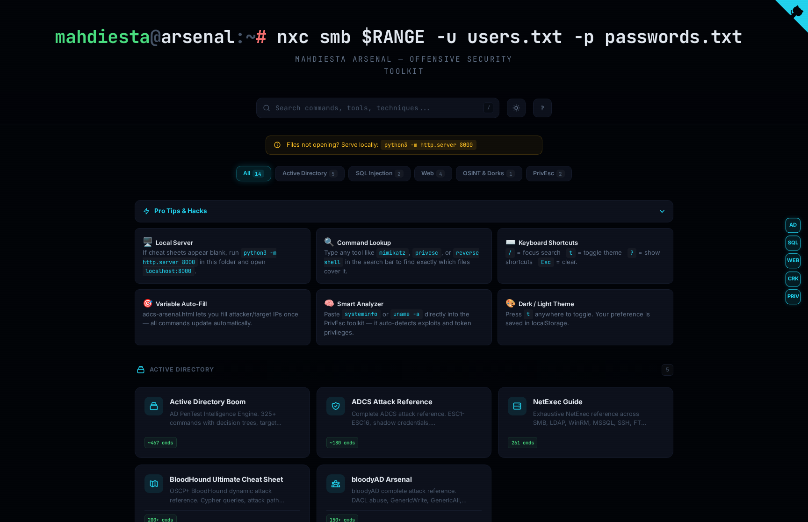
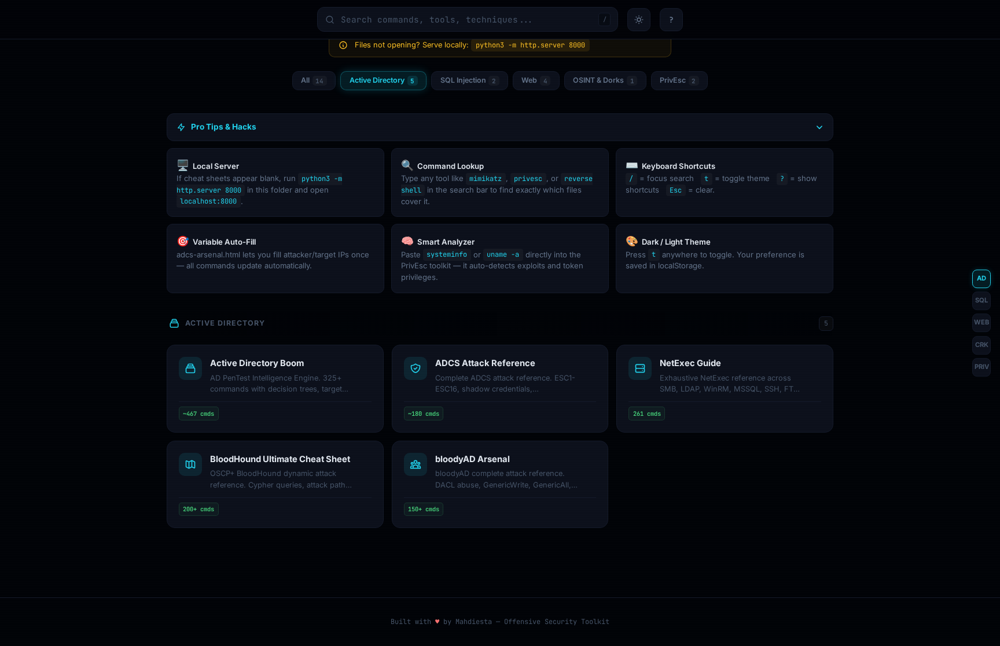
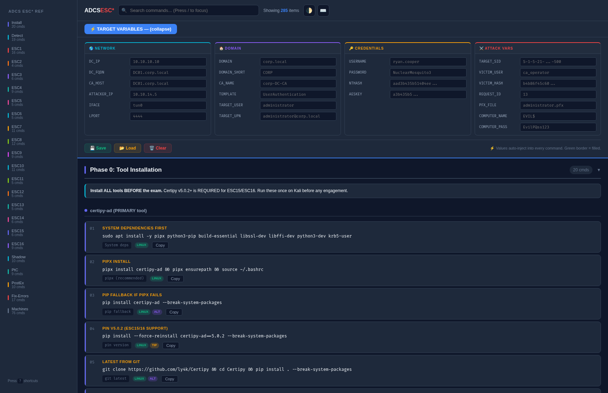
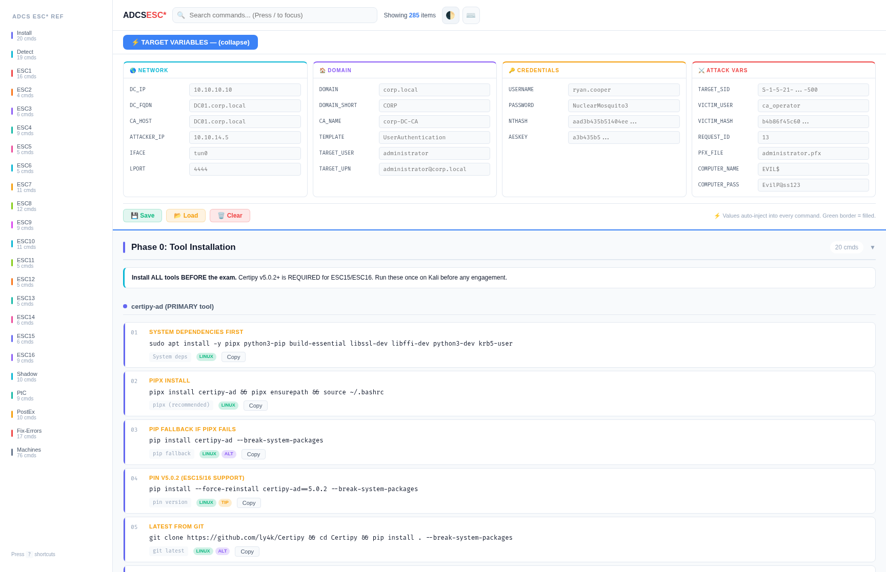
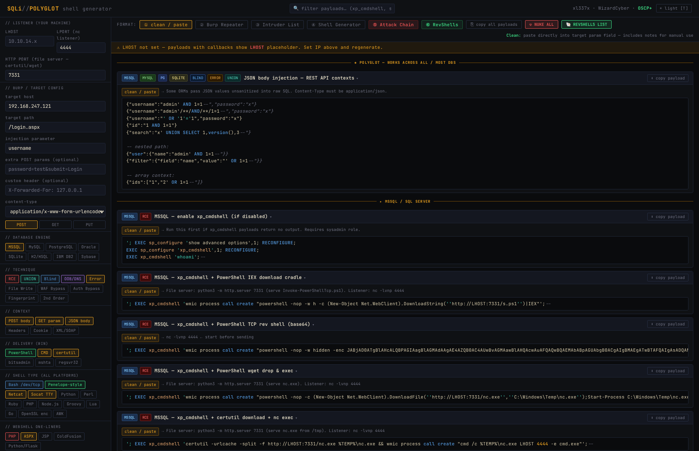
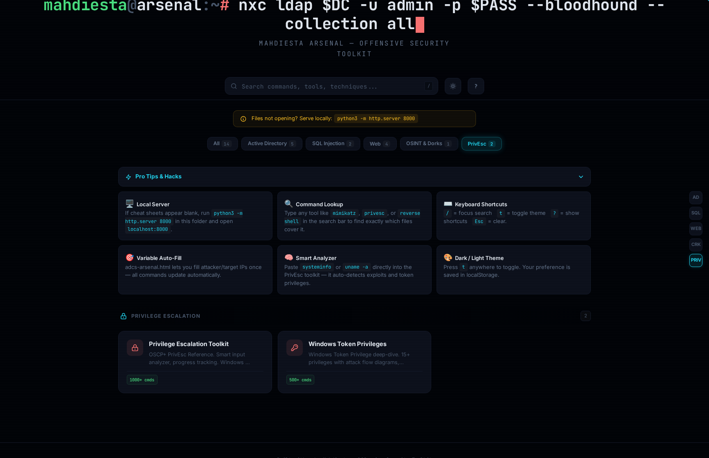

# TheCompleteMahdiestaArsenal

Static browser-based reference for offensive security operations. Set `KALI_IP`, `TARGET`, `USER`, `PASS`, `DOMAIN`, `PORT` once - every command across all 15 modules updates in real time.

[](https://xl337x.github.io/TheCompleteMahdiestaArsenal/)
[](LICENSE)
[]()

---

https://github.com/xl337x/TheCompleteMahdiestaArsenal/raw/main/mahdiesta-arsenal-demo.mp4

---

## Modules

| Module | Coverage |
|---|---|
| **AD Boom** `v5.0` | 325+ commands - NTLM relay, Kerberoasting, AS-REP roasting, RBCD, DCSync, Pass-the-Hash, Pass-the-Ticket, secretsdump |
| **ADCS Arsenal** | ESC1-ESC16 - certipy, PKINIT, shadow credentials, CA/template abuse |
| **NetExec Guide** | SMB / LDAP / RDP / WinRM - credential spray, shares, LSA dump, NTDS, SAM |
| **BloodHound Arsenal** | Attack path methodology + full Cypher query library - shortest paths, owned objects, ACL chains |
| **bloodyAD Arsenal** | DACL/ACL abuse - GenericAll, WriteDACL, GenericWrite, shadow creds, targeted Kerberoast |
| **Rubik's Cube Injector** `v5` | UNION / Blind / Time-based / OOB / Error-based - WAF bypass encodings, sqlmap builder, 1000+ payloads |
| **SQLi → RCE** | `INTO OUTFILE`, `xp_cmdshell`, `LOAD DATA INFILE`, stacked queries |
| **Web Arsenal** | Reverse shells, LFI/RFI, SSRF, file upload bypass, SSTI, path traversal |
| **WebEnum Arsenal** | vhosts, directory brute, tech fingerprinting, API endpoint discovery |
| **AuthBreaker** | JWT manipulation, OAuth abuse, IDOR, session fixation, password reset flaws |
| **Command Injection** | Blind/OOB, filter bypass (space, pipe, semicolon, wildcard) |
| **OSINT Dorks** `v3.0` | Google / Shodan / GitHub / Censys / Fofa - recon, exposed secrets, infra mapping |
| **PrivEsc Toolkit** | Windows: token privs, service hijacking, DLL hijack, unquoted paths, AlwaysInstallElevated, SAM - Linux: SUID, sudo, cron, capabilities |
| **TokenPriv Operator** | SeImpersonate, SeDebug, SeRestore, SeTakeOwnership - GodPotato, PrintSpoofer, RoguePotato |
| **Transfer Arsenal** | File transfer one-liners - HTTP, SMB, FTP, certutil, Base64, PowerShell |

---

## Variable System

Fill once at the top of any module. Every command - certipy, netexec, msfvenom, sqlmap, wget - renders with your values substituted.

```
KALI_IP   TARGET   USER   PASS   DOMAIN   PORT   RPORT   WPATH   LFILE
```

PrivEsc Toolkit adapts per OS - Windows fields (WPATH, SVCBIN) hide on Linux mode, Linux fields (LFILE) hide on Windows mode.

---

## Usage

```bash
git clone https://github.com/xl337x/TheCompleteMahdiestaArsenal
cd TheCompleteMahdiestaArsenal
python3 -m http.server 8000
```

Or open `index.html` directly - no server required.

Live: [xl337x.github.io/TheCompleteMahdiestaArsenal](https://xl337x.github.io/TheCompleteMahdiestaArsenal/)

---

## Screenshots

<table>
<tr>
<td></td>
<td></td>
</tr>
<tr>
<td></td>
<td></td>
</tr>
<tr>
<td></td>
<td></td>
</tr>
</table>

---

## Keyboard Shortcuts

| Key | Action |
|---|---|
| `/` | Focus search |
| `T` | Toggle dark / light theme |
| `Esc` | Clear / close |

---

## Related

| Repo | Description |
|---|---|
| [uploadpwner](https://github.com/xl337x/uploadpwner) | File upload exploitation framework `v6.0` |
| [AuthFinder](https://github.com/xl337x/AuthFinder) | Multi-protocol access discovery + command execution |
| [ligolo-helper](https://github.com/xl337x/ligolo-helper) | Ligolo-ng tunnel setup |
| [transfer_files](https://github.com/xl337x/transfer_files) | File transfer one-liners |

---

## Disclaimer

This project is intended **strictly for authorized penetration testing, CTF competitions, and security research** on systems you own or have explicit written permission to test.

Unauthorized use against systems you do not own or have permission to test is illegal under the Computer Fraud and Abuse Act (CFAA), the Computer Misuse Act (CMA), and equivalent laws in your jurisdiction.

The author assumes no liability for misuse of any content, commands, or techniques referenced in this project. Use responsibly.

---

## Credits & References

This project is a reference interface - it does not redistribute any tool binaries. All tools, projects, and research referenced belong to their respective authors and maintainers.

| Tool | Author / Project |
|---|---|
| [Impacket](https://github.com/fortra/impacket) | Fortra (SecureAuth) |
| [NetExec](https://github.com/Pennyw0rth/NetExec) | Pennyw0rth |
| [BloodHound](https://github.com/BloodHoundAD/BloodHound) | BloodHound Enterprise / SpecterOps |
| [SharpHound](https://github.com/BloodHoundAD/SharpHound) | BloodHoundAD |
| [bloodyAD](https://github.com/CravateRouge/bloodyAD) | CravateRouge |
| [Certipy](https://github.com/ly4k/Certipy) | ly4k |
| [Certify](https://github.com/GhostPack/Certify) | Will Schroeder / GhostPack |
| [Rubeus](https://github.com/GhostPack/Rubeus) | Will Schroeder / GhostPack |
| [PowerSploit / PowerUp](https://github.com/PowerShellMafia/PowerSploit) | PowerShellMafia |
| [winPEAS / linPEAS](https://github.com/carlospolop/PEASS-ng) | carlospolop |
| [GodPotato](https://github.com/BeichenDream/GodPotato) | BeichenDream |
| [PrintSpoofer](https://github.com/itm4n/PrintSpoofer) | itm4n |
| [RoguePotato](https://github.com/antonioCoco/RoguePotato) | antonioCoco |
| [SweetPotato](https://github.com/CCob/SweetPotato) | CCob |
| [ligolo-ng](https://github.com/nicocha30/ligolo-ng) | nicocha30 |
| [sqlmap](https://github.com/sqlmapproject/sqlmap) | sqlmapproject |
| [Metasploit Framework](https://github.com/rapid7/metasploit-framework) | Rapid7 |
| [evil-winrm](https://github.com/Hackplayers/evil-winrm) | Hackplayers |
| [kerbrute](https://github.com/ropnop/kerbrute) | ropnop |
| [ffuf](https://github.com/ffuf/ffuf) | joohoi |
| [feroxbuster](https://github.com/epi052/feroxbuster) | epi052 |
| [gobuster](https://github.com/OJ/gobuster) | OJ Reeves |
| [CrackMapExec](https://github.com/byt3bl33d3r/CrackMapExec) | byt3bl33d3r |
| [enum4linux-ng](https://github.com/cddmp/enum4linux-ng) | cddmp |
| [Responder](https://github.com/lgandx/Responder) | lgandx |
| [mitm6](https://github.com/dirkjanm/mitm6) | dirkjanm |
| [ntlmrelayx](https://github.com/fortra/impacket) | Fortra (SecureAuth) |
| [pypykatz](https://github.com/skelsec/pypykatz) | skelsec |
| [LaZagne](https://github.com/AlessandroZ/LaZagne) | AlessandroZ |
| [mimikatz](https://github.com/gentilkiwi/mimikatz) | gentilkiwi |
| [chisel](https://github.com/jpillora/chisel) | jpillora |
| [pwncat-cs](https://github.com/calebstewart/pwncat) | calebstewart |
| [nikto](https://github.com/sullo/nikto) | sullo |
| [nuclei](https://github.com/projectdiscovery/nuclei) | ProjectDiscovery |

---

MIT - [@mahdiesta](https://github.com/xl337x)
